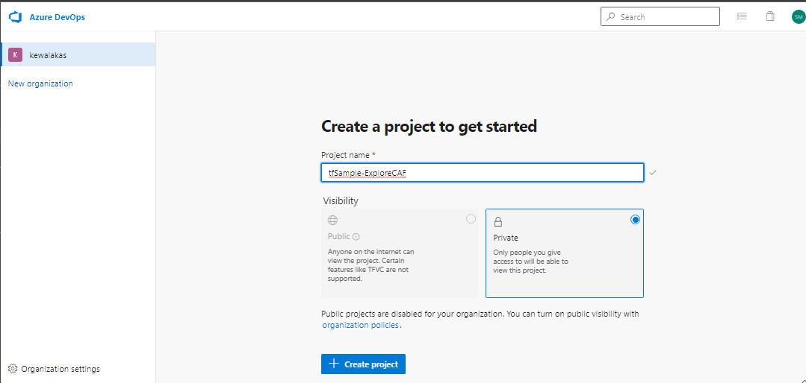
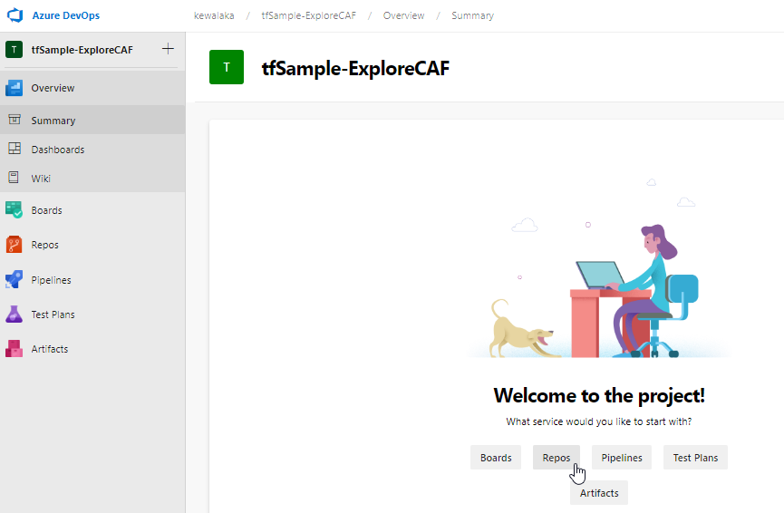
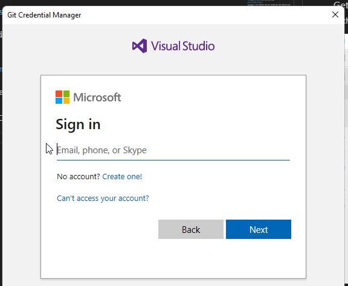
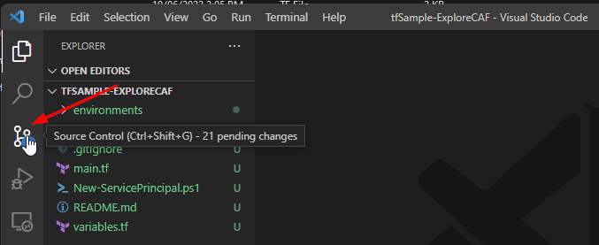

# Getting started with pipelines

## What we'll cover

In this section, we'll cover

* How to get Azure DevOps set up
* Create your first project
* Commit your first check-in to your DevOps project.

You'll need:

* an **Azure subscription**, a free trial will do.
* Either;
  * A Microsoft or GitHub account to create a new Azure DevOps organisation
  * Access to an existing DevOps organisation.

The following free software is required to follow along:

* **Visual Studio Code** (recommended)
* **Git for Windows** (or equivalent, if not using Windows)

## Create an Azure Devops Organisation

If you want to try things out in a lab, you can use Azure DevOps with any Microsoft account.

First, log in to <https://dev.azure.com> and select "Start Free", and log in.

The first time you log in you'll be asked to create a new project:



Subsequently you can create new projects from the organisation home page:


## Azure DevOps Projects

An project is the container that will include your code repository and pipelines.

### Create a location for your source code

Choose a location where you'd like to store your code.  As an example you could use **C:\src** and then store projects by author or DevOps organisation and project name, for example:

```cmd
c:\src\kewalaka\Terraform-CICD-YAMLTemplate
c:\src\<your orgname>\tfSample-CAFSample
```

### Get started with a new repository

In the new project, select "Repos", or choose it from the left hand menu



TODO add import instructions

## Download the resulting repository

Choose "Clone to VSCode"

You'll be prompted to authenticate



Locate the parent folder where you'd like to store your code.  If you're not sure, then use ```c:\src\```.

Then the repository will start cloning:


Select to "open in new window" in a new VS Code window:


## Add some code

Select the source control button:



Enter a description of what is being check-in, e.g. "initial commit", and press Ctrl+[Enter]

## What next?

Now you've created your first project, you can use a template to [add a pipeline to an existing project](/docs/Add%20Pipelines%20To%20An%20Existing%20Project.md).
